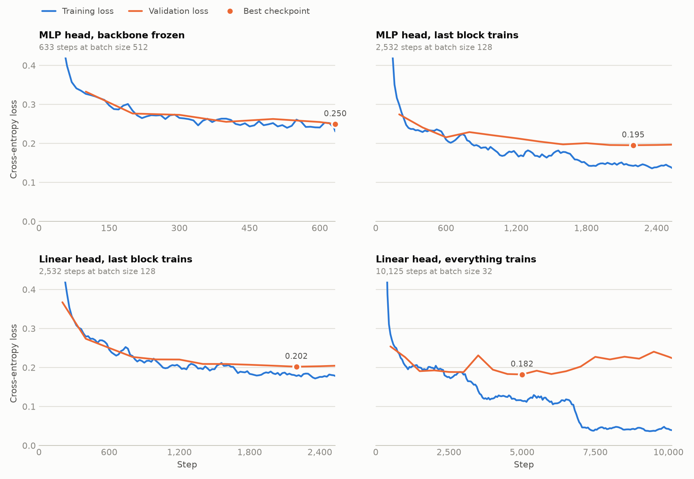
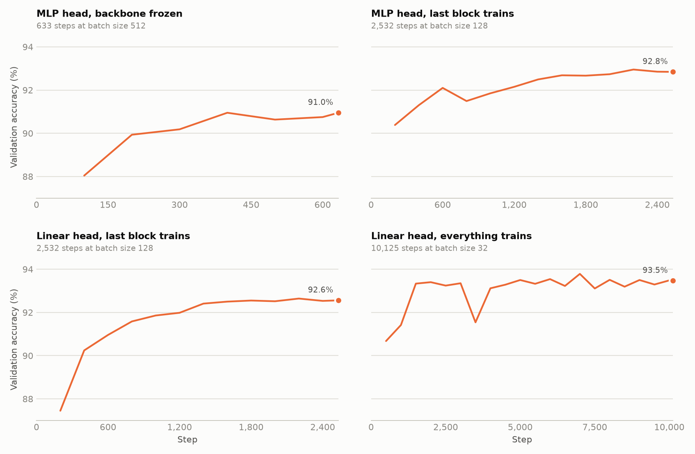

# AG News classification

Fine-tuning the released GPT-2 small weights to classify
[AG News](https://huggingface.co/datasets/sh0416/ag_news) headlines into four
topics, comparing how much of the model needs to train.

## Results

One run per setup on 1 October 2026, each for 3 epochs on a single RTX 2080
(8 GB). Test numbers come from the checkpoint with the lowest validation loss.

| Setup | Script | Trainable params | Test accuracy | Test loss | Best val loss (step) | Time |
|---|---|---|---|---|---|---|
| MLP head, backbone frozen | `train_mlp_head.py` | 2.4M | 90.76% | 0.2578 | 0.2495 (633 of 633) | 20 min |
| MLP head, last block trains | `train_mlp_head_last_block.py` | 9.5M | 93.28% | 0.1948 | 0.1953 (2,200 of 2,532) | 26 min |
| Linear head, last block trains | `train_linear_head_last_block.py` | 7.1M | 92.63% | 0.2100 | 0.2020 (2,200 of 2,532) | 25 min |
| Linear head, everything trains | `train_linear_head_full.py` | 124.4M | 94.20% | 0.1784 | 0.1822 (5,000 of 10,125) | 63 min |



One panel per setup, each against its own step count, on a shared loss scale.
Training loss is averaged over about 10,000 examples so the four batch sizes
are comparable. The dot marks the checkpoint with the lowest validation loss.



Validation accuracy on a shared scale, labelled with its value at the final
step.

## What the runs show

- **Unfreezing the last block is the cheap win.** It lifts test accuracy from
  90.8% to 93.3% for six more minutes of training.
- **Full fine-tuning is best, at more than twice the cost.** It adds roughly
  one more point (94.2%) and takes 63 minutes instead of 26.
- **Full fine-tuning overfits in the third epoch.** Its training loss steps
  down at each epoch boundary, to about 0.04 by the end, while validation loss
  climbs from 0.182 at step 5,000 to 0.224. Keeping the best checkpoint rather
  than the last one is what preserved the result; two epochs would have been
  enough.
- **The frozen backbone had not finished improving.** Its best validation loss
  was at the final step, so more epochs would likely help a little.
- **The MLP head beat the linear head by 0.65 points** with the last block
  unfrozen. That is one seed and about two standard errors on 7,600 test
  examples, so treat it as suggestive.

## Setup

- **Data:** 108,000 training, 12,000 validation (the last 10% of the training
  split) and 7,600 test examples, truncated or padded to 128 tokens.
- **Classification:** from the logits at each example's last real token.
- **Optimisation:** AdamW, no weight decay, cosine decay to a tenth of the
  peak learning rate after a linear warmup. Dropout is off.

| Setup | Batch | Peak LR | Warmup steps |
|---|---|---|---|
| MLP head, backbone frozen | 512 | 3e-4 | 20 |
| MLP head, last block trains | 128 | 1e-4 | 100 |
| Linear head, last block trains | 128 | 1e-4 | 100 |
| Linear head, everything trains | 32 | 3e-5 | 300 |

Batch size and learning rate differ between setups and were not tuned, so the
comparison is between these configurations rather than a controlled one.

## Reproducing

```bash
classification/run_all.sh checkpoints/classification
```

This runs all four, two at a time across GPUs 0 and 1. See the Classification
section of the top-level README for running a single setup and for what each
run saves.

Runs are logged to the `gpt2-classification-sft` W&B project.
