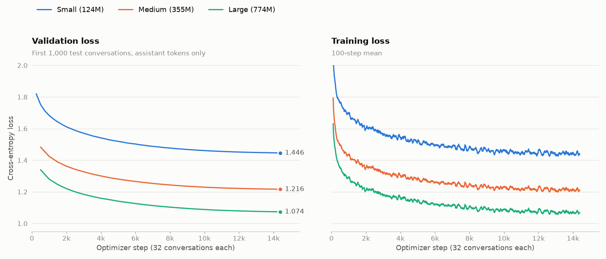
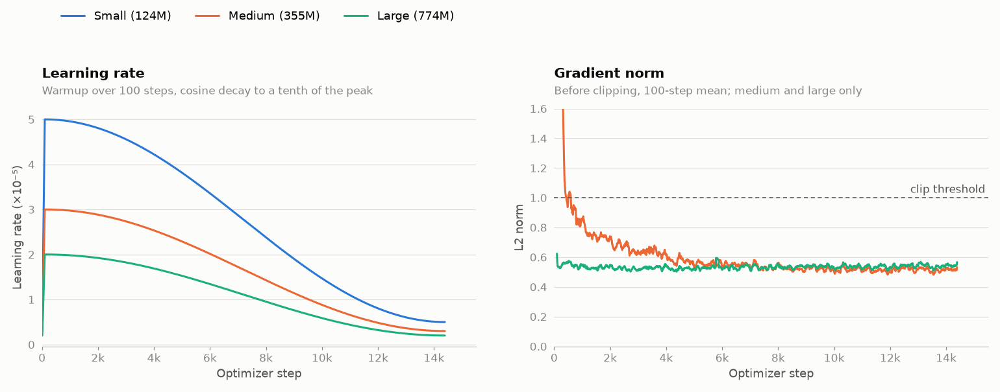

# Instruction tuning

Fine-tuning the released GPT-2 small, medium and large weights into chat
models on [smol-smoltalk](https://huggingface.co/datasets/HuggingFaceTB/smol-smoltalk),
with the loss on assistant replies only.

## Results

One run per size on 5 October 2026, each a single pass over the 460,341
training conversations (14,386 steps of 32 conversations). The best
checkpoint was the final step in all three.

| Model | Script | Params | Best val loss | Final train loss | Hardware | Time |
|---|---|---|---|---|---|---|
| Small | `train.py` | 124M | 1.446 | 1.442 | RTX 2080, fp32 | 14.2 h |
| Medium | `train_medium.py` | 355M | 1.216 | 1.213 | H100, bf16 | 54 min |
| Large | `train_large.py` | 774M | 1.074 | 1.070 | H100, bf16 | 1.7 h |

Validation loss is the mean over assistant tokens in the first 1,000
conversations of the test split. Final train loss is the mean of the last
1,000 steps. The three sizes share the tokenizer, validation set and loss
masking, so their losses are directly comparable. Their times are not,
because small ran on different hardware.



Validation is scored every 250 steps for small and every 500 for medium and
large, plus once at the final step.



The small run started before gradient norm was logged, so only medium and
large appear on the right.

## Sample replies

Replies from each best checkpoint, sampled with temperature 1 and top-5 at
up to 128 tokens. Medium and large are the samples logged at their final
step. Small's run predates top-k sampling, so its replies here were
regenerated from its checkpoint with the same settings. Replies that stop
mid-sentence hit the 128-token limit.

**What is the capital of France?** (with the system prompt "You are a
helpful assistant.")

| Model | Reply |
|---|---|
| Small | The capital of France is Saint-Ouen-sur-Mer in Belgium. |
| Medium | The capital of France is Paris. It is situated in the northern part of the country, and it is a major cultural, historical, and commercial center of the French Republic. |
| Large | The capital of France is Paris. It is a city known for its rich history and cultural significance. Paris is located in the northern part of France, and it is a major tourist destination. |

**How do I make a cup of tea?**

| Model | Reply |
|---|---|
| Small | Crafting a cup of tea sounds simple, but it's an essential step. To make a cup of tea, start by preparing the tea leaves. Start with a well-draining tea tree, which contains essential oils, herbs, and spices, such as ginger, bay leaf, and cinnamon. … |
| Medium | Making tea is a simple and delicious way to enjoy a cup. The key to making good tea is to focus on fresh, high-quality leaves … Fill it with water, add your tea leaves, and place the tea bag or container on top to hold it. Let the tea steep for about 10-15 minutes to allow it to steep |
| Large | Making a cup of tea can be a fun and rewarding experience. … Place the tea bag in the hot water, and let it steep for about 3-5 minutes, depending on the strength of the tea you're making. Once the tea steeps, remove the tea bag and strain the leaves, then gently remove them from the tea pot and add the hot water. … |

**Write a haiku about the ocean.**

| Model | Reply |
|---|---|
| Small | The ocean is a vast and wondrous realm, a realm that has been shaped by our actions and our thoughts. It is a place of endless beauty … (prose, to the token limit) |
| Medium | As the ocean stretches out, / In every direction / The sea's waves rise high and low / A gentle breeze carries on / As I swim through the water … (11 lines) |
| Large | Seas, endless, yet boundless, / In a sea of white, we find / The gentle waves, a soothing breeze / A reminder of our boundless / Ocean, our home, our home for ever. |

Before fine-tuning, all three continued the prompt as web text instead of
answering it, for example a numbered rulebook about tea, a bus-journey diary,
or "Alfonso" repeated to the token limit.

## What the runs show

- **All three learned the chat format.** Each answers in the assistant's
  voice and ends short replies with `<|assistant-end|>` instead of running
  on.
- **Larger models do better throughout.** Validation loss drops by
  0.23 from small to medium and by 0.14 from medium to large. The samples
  follow: small gets the capital of France wrong, while medium and large get
  it right. Only large stays close to the requested form for the haiku,
  though none of them manages 5-7-5.
- **Coherence over longer replies is still weak at every size.** The tea
  instructions drift or contradict themselves (medium steeps for 10-15
  minutes; large strains the leaves and then adds the water).
- **No overfitting, and little left to gain from the same data.** Final
  training loss is within 0.005 of validation loss for every size. Over the
  last 2,400 steps, validation loss fell by about 0.002 per 1,000 steps for
  all three, with the learning rate near its floor. A second epoch would
  probably add little.
- **Medium started with large gradients; large did not.** Medium's gradient
  norm was above the 1.0 clip threshold on about two thirds of its first 600
  steps, then settled near 0.52; about 3% of all its steps were clipped. Large stayed near 0.53
  throughout and was clipped on 0.1% of steps. The cause is not established.

## Setup

- **Data:** 460,341 training conversations. The test split (24,229
  conversations) has no separate role here, so its first 1,000 serve as the
  validation set.
- **Format:** each message is wrapped in role tokens (`<|system-start|>`,
  `<|user-start|>`, `<|assistant-start|>` and matching end tokens), six new
  tokens appended to the GPT-2 vocabulary. Their embeddings start at the
  mean of the existing ones; random initial values put them above every real
  token and start the loss near 90. Conversations are truncated at 1,024
  tokens, which cuts off 44% of the first 500 test conversations.
- **Loss:** cross-entropy on assistant content and `<|assistant-end|>` only,
  averaged over those tokens across each 32-conversation step.
- **Optimisation:** AdamW with betas (0.9, 0.95) and no weight decay. The
  learning rate warms up linearly over 100 steps, then follows a cosine
  decay to a tenth of its peak. Gradients are clipped at 1.0. Dropout is
  off, the model is compiled with `torch.compile`, and the seed is 1337.

| Model | Batch × accumulation | Peak LR |
|---|---|---|
| Small | 2 × 16 | 5e-5 |
| Medium | 16 × 2 | 3e-5 |
| Large | 16 × 2 | 2e-5 |

## Reproducing

```bash
uv run python instruct/train.py --checkpoint-dir checkpoints
uv run python instruct/train_medium.py --checkpoint-dir checkpoints
uv run python instruct/train_large.py --checkpoint-dir checkpoints
```

`--device-id` picks the GPU (0 or 1) and defaults to 0. Each run gets its own
`<checkpoint_name>_<YYYYmmdd_HHMMSS>` directory holding `config.json` and
`best.safetensors`, the weights at the lowest validation loss. Runs are
logged to the `gpt2-instruct-sft` W&B project, including the sample replies
at every validation as a table.
