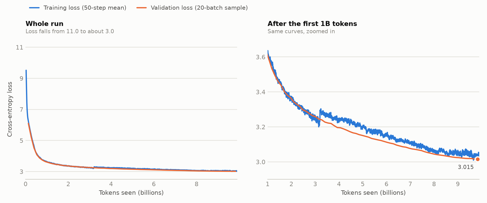
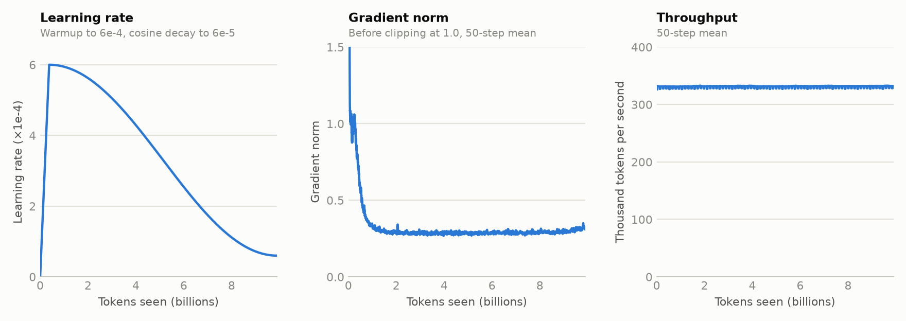

# Pretraining

Training GPT-2 small (124M parameters) from scratch on the FineWeb-Edu
`sample-10BT` sample, with the model and training loop in this repository.

## Results

One run, `serene-totem-1`, on 1 October 2026: a single pass over the training
file on one NVIDIA H100 (80 GB).

| | |
|---|---|
| Final validation loss (whole 50M-token validation file) | 3.026 (perplexity 20.6) |
| Last sampled validation loss (step 18,750) | 3.015 |
| Training loss, mean of the last 100 steps | 3.028 |
| Steps | 18,890 |
| Tokens seen | 9.90B (one epoch) |
| Wall-clock time | 8.4 hours |
| Throughput | 332,000 tokens per second |



Training loss is a 50-step mean. Validation loss is the periodic sample: the
same first 20 batches (1,280 sequences) of the validation file, scored every
250 steps.



## What the run shows

- **Loss was still falling at the end.** The validation sample went from
  3.020 to 3.015 over the last 1,000 steps, even with the learning rate near
  its floor, so more tokens would likely help.
- **No sign of overfitting.** Training loss ends at 3.028 against a final
  validation loss of 3.026, as expected from a single pass.
- **Training loss steps up by about 0.03 at 3.2B tokens.** Validation loss
  does not move there and the run did not pause. The cause is not established.
- **Optimisation was stable.** The gradient norm starts near 15, drops to
  about 1 within 100 steps, and settles around 0.29 after the first 1B tokens.
  Clipping at 1.0 was active on 1.6% of steps, 99% of them in the first 1,000.
- **Throughput was flat** at about 332,000 tokens per second throughout.

## Setup

- **Data:** 9.90B training tokens and a 50M-token validation file, both from
  `preprocess.py`, in sequences of 1,024 tokens.
- **Batch:** 524,288 tokens per optimizer step, as 8 accumulated micro-batches
  of 64 sequences.
- **Optimisation:** AdamW with betas (0.9, 0.95) and weight decay 0.1 on
  weight matrices only. The learning rate warms up linearly over 715 steps to
  6e-4, then follows a cosine decay to 6e-5. Gradients are clipped at 1.0.
- **Model:** dropout 0, compiled with `torch.compile`.
- **Seed:** 1337.

## Reproducing

```bash
uv run python pretraining/train.py \
    --train-dataset datasets/fineweb/train.bin \
    --val-dataset datasets/fineweb/val.bin \
    --checkpoint-dir checkpoints
```

See the Prepare data and Pretrain sections of the top-level README for
building the token files, checkpointing and resuming. Runs are logged to the
`gpt2-repro` W&B project.
